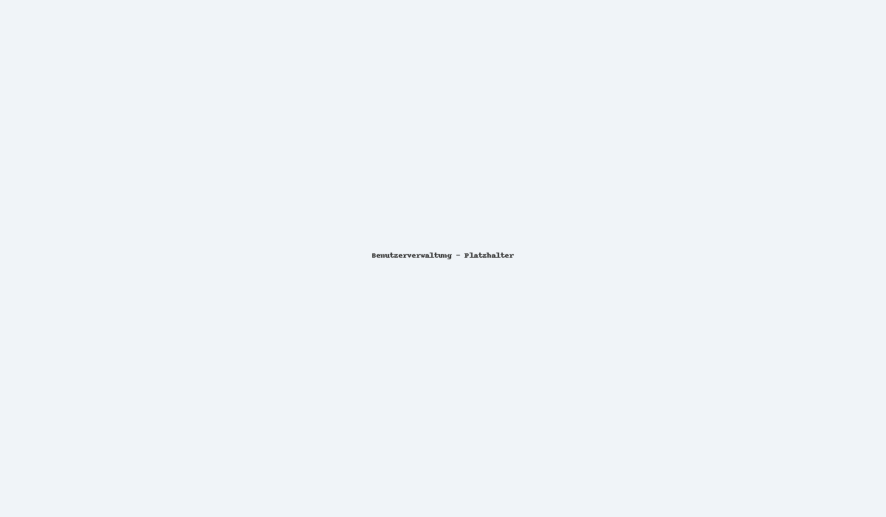

## Einstieg
- **Login** mit Ihrer User-Administrator-Kennung.
- Ueber das Symbol **Benutzerverwaltung** zur Uebersicht wechseln.

## Neuer Benutzer
1. **Pruefen**, ob der gewuenschte Benutzername bereits existiert.
2. **Persoenliche Geschaefts-E-Mail** hinterlegen (keine Sammeladressen).
3. Benutzer **hinzufuegen** - der Nutzer erhaelt eine **Registrierungs-E-Mail** mit Benutzername und einmaligem Passwort.
4. Beim ersten Login wird ein **neues Passwort** gesetzt.

## Austritt / Deaktivierung
- Bei Mitarbeiteraustritt das **Benutzerkonto deaktivieren** (Compliance/Security).
