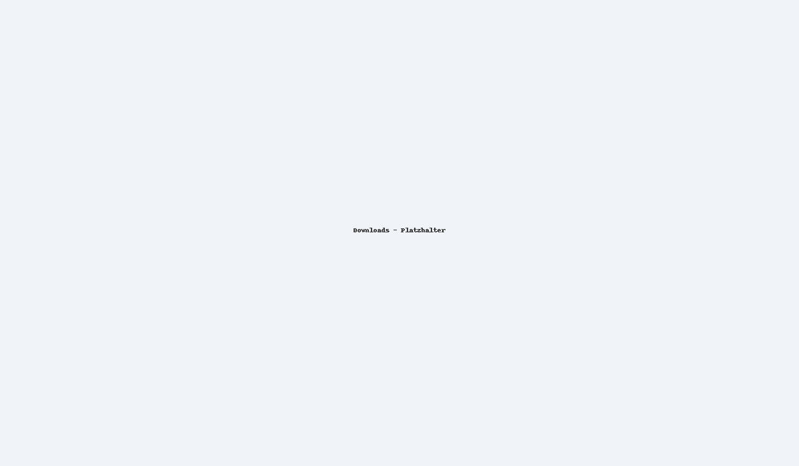
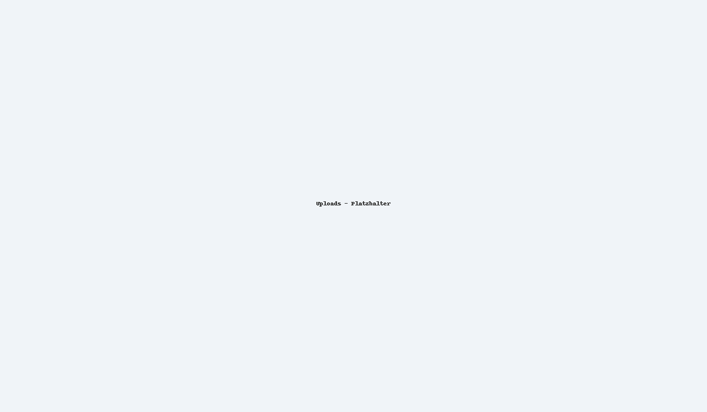

## Download
- **Listen & Dateien -> Download**: Periodische Dateien der BVK (z. B. Beitragsverarbeitung, leere Lohnlisten).
- **Suche**, **Sortierung** und **Filter nach TAGS** ver fuergbar.
- Dateien bleiben **bis zu 720 Tage** ver fuergbar.

> **Benachrichtigungen:** Lohnadministratoren/HR-Verantwortliche erhalten bei neuen Dateien **E-Mail-Notifikationen**.

## Upload
- **Listen & Dateien -> Upload**: Uebermittlung von Dateien (z. B. Stammdaten/Lohndaten/Beitragsdaten, bearbeitete Lohnlisten).
- Upload via **Drag & Drop** oder Dateidialog.
- Hochgeladene Dateien sind bis zu **720 Tage** sichtbar.

> Bestimmte Upload-Kategorien sind nur ver fuergbar, wenn eine **Datenaustausch-Vereinbarung** besteht.
