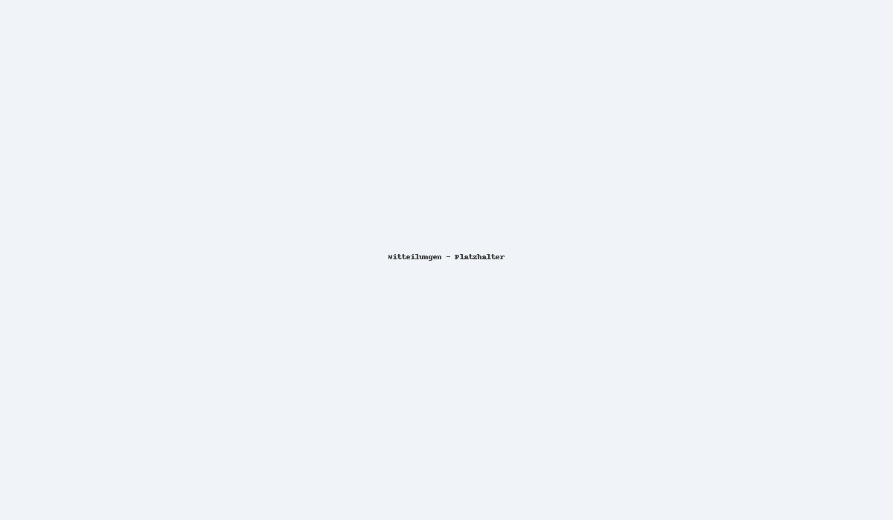
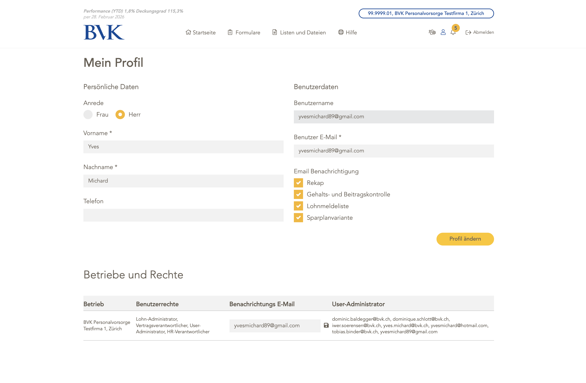

## Mitteilungen
- Aktuelle Portalhinweise unter **Mitteilungen** (Glocken-Symbol). 
- Neue Mitteilungen erscheinen nach dem Login; fruehere Mitteilungen koennen jederzeit eingesehen werden.

## Mein Profil
- Persönliche E-Mail-Adresse für Login-Codes und Benachrichtigungen pflegen.
- Einsicht in eigene Berechtigungen und zugewiesene Verträge.

## Vertraege wechseln
- Falls Sie mehrere Verträge betreuen, können Sie via **Vertrag wechseln** zwischen ihnen umschalten.
