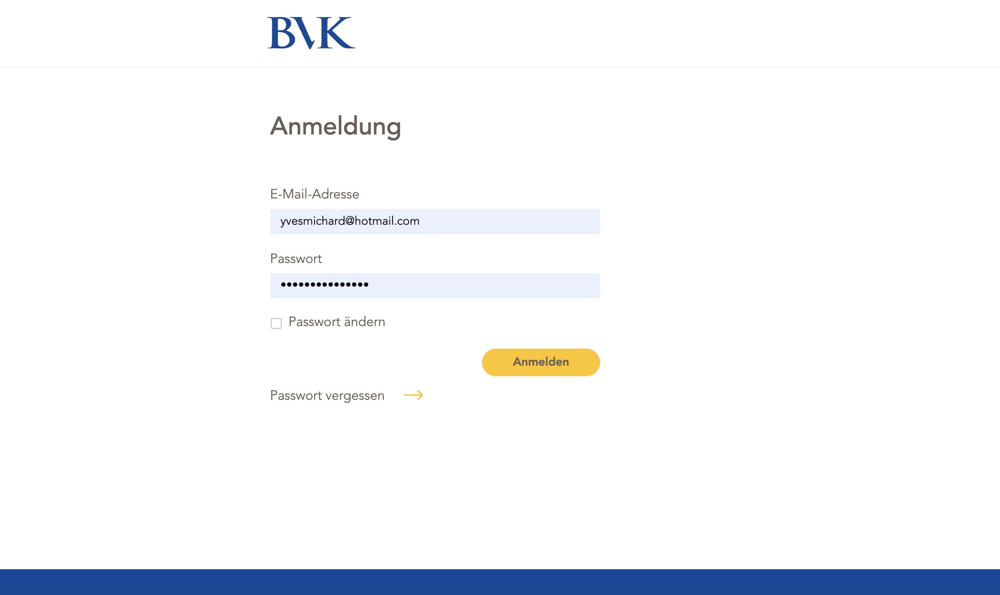

## Anmeldung in drei Schritten
1. **Benutzername & Passwort** eingeben und **Anmelden** klicken.
2. **Sicherheitscode** aus E-Mail eingeben (Zweiter Faktor).
3. **Vertrag auswaehlen** (falls mehrere Berechtigungen vorhanden).

## Sitzungs-Timeout
- Nach **20 Minuten ohne Aktion** werden Sie automatisch abgemeldet.
- Melden Sie sich danach erneut an.

## Haeufige Login-Hinweise
- **Code kommt ver spaetet an?** Zustellzeit haengt von Ihrem E-Mail-Anbieter ab.
- **Browser speichert ein falsches Passwort?** Gespeicherte Zugangsdaten im Browser loeschen.
- **Seite laedt endlos?** Seite aktualisieren (z. B. Taste `F5`).

## E-Mail-Adressen
- Hinterlegen Sie unter **Mein Profil** Ihre **persoenliche Geschaefts-E-Mail-Adresse** fuer Login-Codes und Benachrichtigungen.

